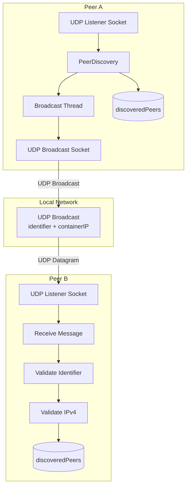

# Peer Architecture

This flowchart shows the network communication architecture

```mermaid
flowchart TD
    subgraph PeerA["Peer A"]
        A1["PeerDiscovery"]
        A2["Broadcast Thread"]
        A3["UDP Broadcast Socket"]
        A4["UDP Listener Socket"]
        A5[("discoveredPeers")]
        A1 --> A2 --> A3
        A4 --> A1
        A1 --> A5
    end

    subgraph Network["Local Network"]
        B["UDP Broadcast<br/>identifier + containerIP"]
    end

    subgraph PeerB["Peer B"]
        C1["UDP Listener Socket"]
        C2["Receive Message"]
        C3["Validate Identifier"]
        C4["Validate IPv4"]
        C5[("discoveredPeers")]
        C1 --> C2 --> C3 --> C4 --> C5
    end

    A3 -->|"UDP Broadcast"| B
    B -->|"UDP Datagram"| C1
```
