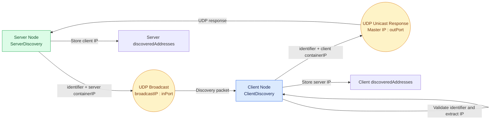
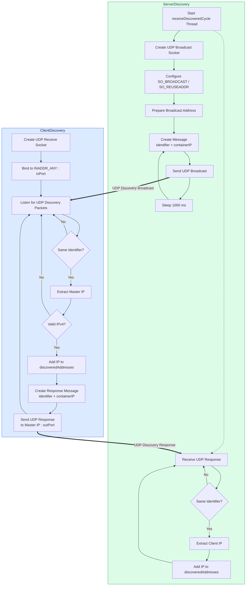

# Architecture

This page shows you how the Server - Client discovery works, before you start reading the code.

## Network communication

```mermaid

flowchart LR
    S["Server Node<br/>ServerDiscovery"]
    B(("UDP Broadcast<br/>broadcastIP : inPort"))
    C["Client Node<br/>ClientDiscovery"]
    R(("UDP Unicast Response<br/>Master IP : outPort"))

    S -->|"identifier + server containerIP"| B
    B -->|"Discovery packet"| C
    C -->|"Validate identifier and extract IP"| C
    C -->|"identifier + client containerIP"| R
    R -->|"UDP response"| S

    S -->|"Store client IP"| SD["Server discoveredAddresses"]
    C -->|"Store server IP"| CD["Client discoveredAddresses"]

    style S fill:#dcfce7,stroke:#16a34a,color:#14532d
    style C fill:#dbeafe,stroke:#2563eb,color:#172554
    style B fill:#fef3c7,stroke:#d97706,color:#78350f
    style R fill:#fef3c7,stroke:#d97706,color:#78350f

```

## Network architecture

```mermaid

flowchart TB
    subgraph CLIENT["ClientDiscovery"]
        C1["Create UDP Receive Socket"]
        C2["Bind to INADDR_ANY : inPort"]
        C3["Listen for UDP Discovery Packets"]
        C4{"Same Identifier?"}
        C5["Extract Master IP"]
        C6{"Valid IPv4?"}
        C7["Add IP to discoveredAddresses"]
        C8["Create Response Message<br/>identifier + containerIP"]
        C9["Send UDP Response<br/>to Master IP : outPort"]

        C1 --> C2 --> C3 --> C4
        C4 -- No --> C3
        C4 -- Yes --> C5 --> C6
        C6 -- No --> C3
        C6 -- Yes --> C7 --> C8 --> C9
        C9 --> C3
    end

    subgraph SERVER["ServerDiscovery"]
        S1["Start receiveDiscoveredCycle Thread"]
        S2["Create UDP Broadcast Socket"]
        S3["Configure SO_BROADCAST / SO_REUSEADDR"]
        S4["Prepare Broadcast Address"]
        S5["Create Message<br/>identifier + containerIP"]
        S6["Send UDP Broadcast"]
        S7["Sleep 1000 ms"]
        S8["Receive UDP Response"]
        S9{"Same Identifier?"}
        S10["Extract Client IP"]
        S11["Add IP to discoveredAddresses"]

        S1 --> S2 --> S3 --> S4 --> S5 --> S6 --> S7
        S7 --> S5
        S1 -.-> S8
        S8 --> S9
        S9 -- No --> S8
        S9 -- Yes --> S10 --> S11 --> S8
    end

    S6 == "UDP Discovery Broadcast" ==> C3
    C9 == "UDP Discovery Response" ==> S8

    style CLIENT fill:#dbeafe,stroke:#2563eb,color:#172554
    style SERVER fill:#dcfce7,stroke:#16a34a,color:#14532d
```
